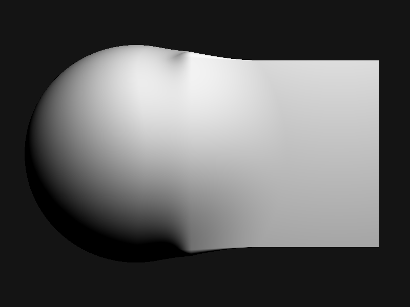

# Raymarcher

A raymarcher built from scratch in Java: no engine, no shader language, no
graphics library. Just signed distance functions, sphere tracing, and a
`BufferedImage`.



Two shapes (a sphere and a box) combined with a smooth minimum instead of a
hard union, so they merge into one continuous surface instead of colliding.
Includes normal estimation via finite differences, diffuse lighting, and
2x2 supersampled antialiasing.

Distance function formulas are from Inigo Quilez's
[iquilezles.org](https://iquilezles.org/articles/distfunctions/).

## Run it

```
cd src
javac Main.java
java Main
```

Full writeup: [Marching with rays](https://sslog.dpdns.org/marching-with-rays.html)
